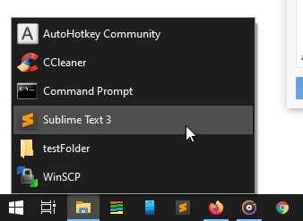
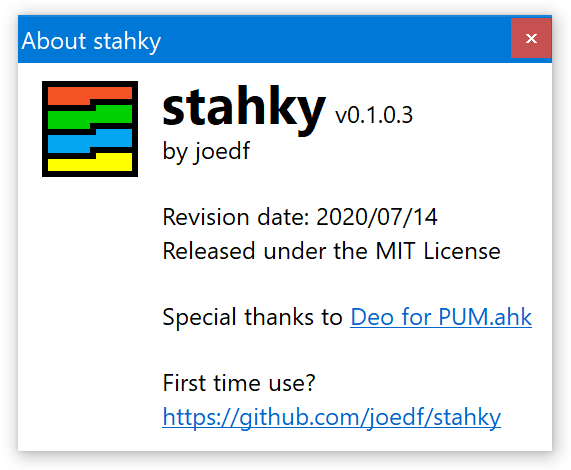
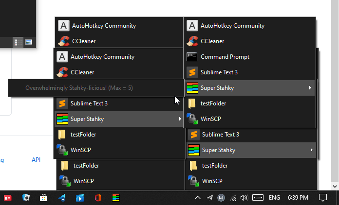

#  stahky
A take on [stacky](https://github.com/pawelt/stacky) in AutoHotkey (AHK) for Windows 10

## Usage
- Drag a folder with shortcuts, programs and files onto Stahky
  - A taskbar pinnable icon / shortcut will be created in the same folder as Stahky itself.
  - You should edit the shortcut's icon before pinning it.
  - Once pinned, you can delete the shortcut file.
  - Note: you can set files as hidden if you don't want them to appear in the Stahky menu.
  - Note: You can drag a folder along with a stahky ini config file to use separate settings for each shortcut.
- Appearance, DPI, offsets, etc. settings
  - Colors are determined automatically on the first run
  - Edit stahky.ini for specific colors, offsets (x or y), use DPI for size and position calculation, ...
  - The `SortFoldersFirst` option allows you to have folders appear first at the top of each menu accordingly.
- Submenus
  - You can use a normal folder and customize it's icon (in properties)
    - Use a shortcut to a folder, if you want to be able to open it instead of a having submenu
  - You can have stahky shortcuts within your folder for custom submenus. Stahky-licious!
    - Stahkys that have circular references will be capped by the recursion depth setting `STAHKY_MAX_DEPTH` (default is 5).
- Press <kbd>WheelButton</kbd> / <kbd>MButton</kbd> on
  - a stahky to open its target folder for easy editing.
  - any item to open its parent folder.
  - Set `exitAfterFolderOpen=0` in the ini config file to keep Stahky on-screen after opening a folder
- Intended to run as a compiled binary (best experience), but the script can be executed directly.
- There is `/config` argument that can be used to specify a ini config file to use at runtime, e.g. `Stahky.exe /stahky "C:/my/folder" /config "C:/my/stahky/config/file.ini"`
- Press <kbd>Shift</kbd>+<kbd>Win</kbd>+<kbd>a</kbd> or Right-click (<kbd>RButton</kbd>) any item in a stacky to show the About/First-time-use dialog to easily check the version and other information.
- If Stahky takes too long to load, it will warn you of including folders that are too large.
  - this time limit `STAHKY_MAX_RUN_TIME` can be changed but has a minimum of 1000 ms and maximum of 10 s of wait time (default is 3500 ms).

## Screenshots

